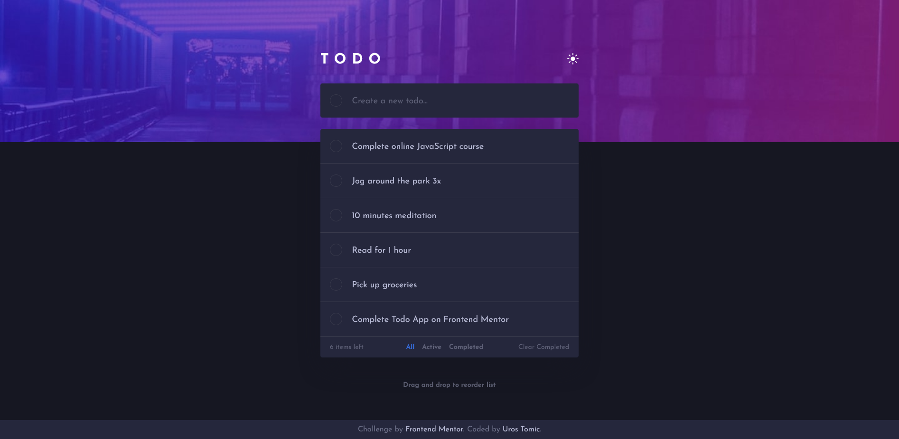

# Frontend Mentor - Todo app solution

This is a solution to the [Todo app challenge on Frontend Mentor](https://www.frontendmentor.io/challenges/todo-app-Su1_KokOW). Frontend Mentor challenges help you improve your coding skills by building realistic projects. 

## Table of contents

- [Overview](#overview)
  - [The challenge](#the-challenge)
  - [Screenshot](#screenshot)
  - [Links](#links)
- [My process](#my-process)
  - [Built with](#built-with)
  - [What I learned](#what-i-learned)
  - [Continued development](#continued-development)
  - [Useful resources](#useful-resources)
- [Author](#author)

## Overview

### The challenge

Users should be able to:

- View the optimal layout for the app depending on their device's screen size
- See hover states for all interactive elements on the page
- Add new todos to the list
- Mark todos as complete
- Delete todos from the list
- Filter by all/active/complete todos
- Clear all completed todos
- Toggle light and dark mode
- **Bonus**: Drag and drop to reorder items on the list

### Screenshot




### Links

- Solution URL: [https://www.frontendmentor.io/solutions/tailwindcss-vue-mobilefirstworkflow-IGT0RqDRZ](https://www.frontendmentor.io/solutions/tailwindcss-vue-mobilefirstworkflow-IGT0RqDRZ)
- Live Site URL: [https://mrgeminus.github.io/todo-app-main/](https://mrgeminus.github.io/todo-app-main/)

## My process

### Built with

- Semantic HTML5 markup
- [CSS framework Tailwind](https://tailwindcss.com/)
- Flexbox
- Mobile-first workflow
- [Vue](https://vuejs.org/)

### What I learned

I learned the basics of the JavaScript framework Vue.js.

```js
const proudOfThisFunc = () => {
  console.log('🎉')
}
```

### Continued development

### Useful resources

- [Tailwind CSS documentation](https://tailwindcss.com/docs) - This helped me for XYZ reason. I really liked this pattern and will use it going forward.
- [Vue V3 documentation](https://v3.vuejs.org/guide/introduction.html) - This is an amazing article which helped me finally understand XYZ. I'd recommend it to anyone still learning this concept.

- [Vue JS Crash Course 2021](https://www.youtube.com/watch?v=qZXt1Aom3Cs&t=5414s) - This is an amazing article which helped me finally understand XYZ. I'd recommend it to anyone still learning this concept.

## Author

- Website - [Uros Tomic](https://mrgeminus.com/)
- Frontend Mentor - [@MrGeminus](https://www.frontendmentor.io/profile/MrGeminus)
- LinkedIn - [Uros Tomic](https://www.linkedin.com/in/mrgeminus/)
- Xing - [Uros Tomic](https://www.xing.com/profile/Uros_Tomic3/cv)
- StackOverflow - [MrGeminus](https://www.linkedin.com/in/mrgeminus/)
- Twitter - [@MrGeminus](https://twitter.com/MrGeminus)
